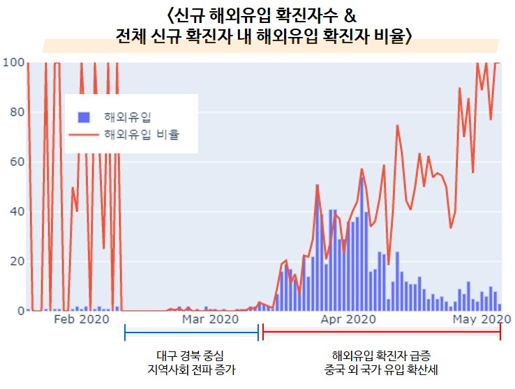
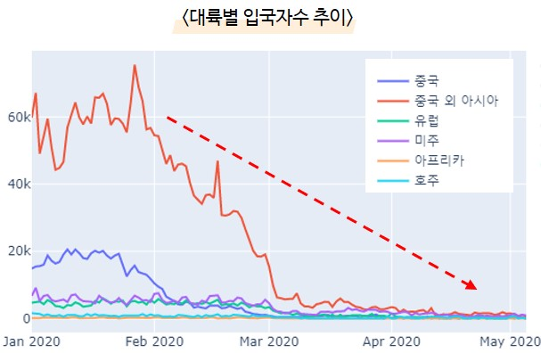
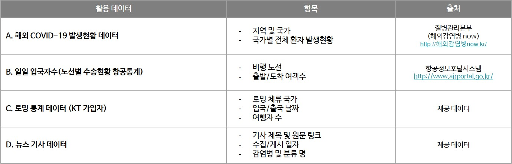
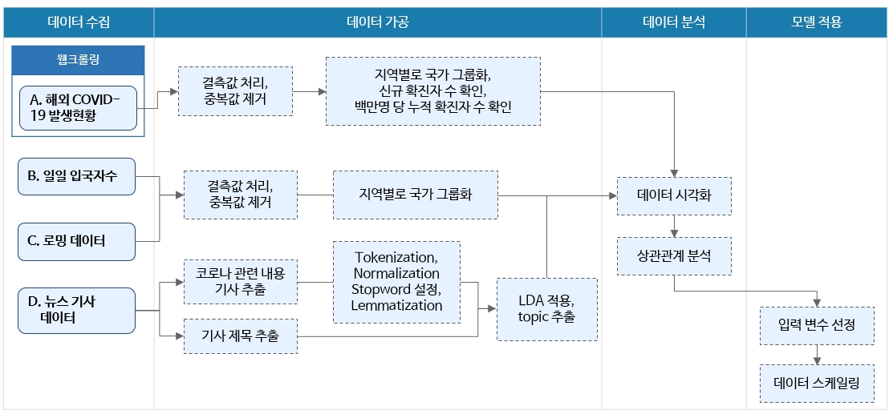
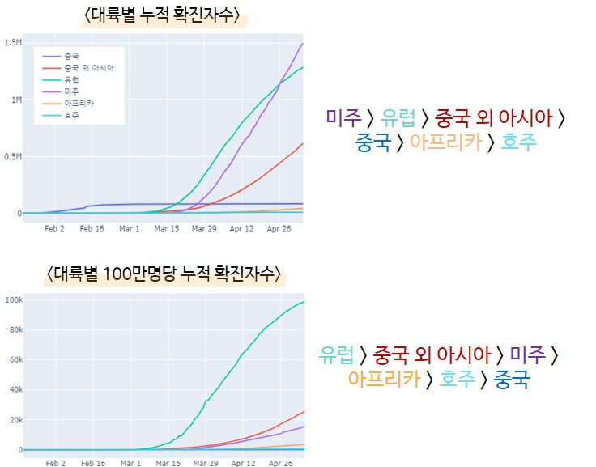
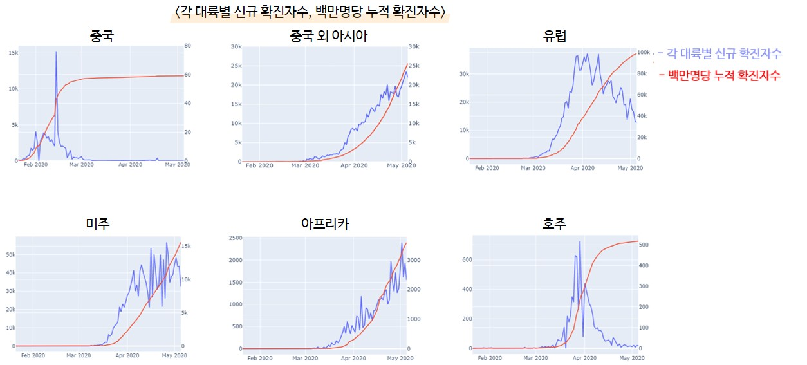
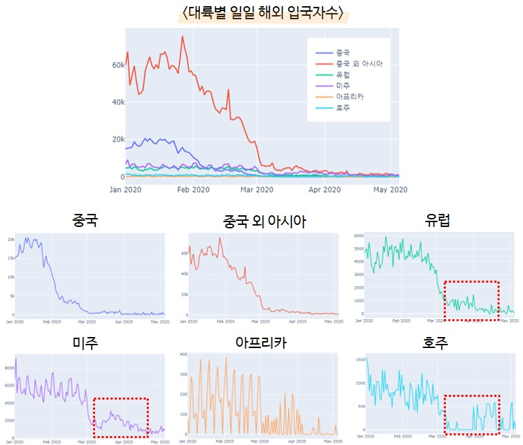
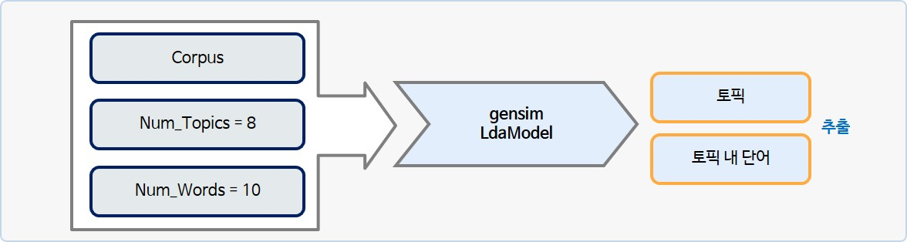
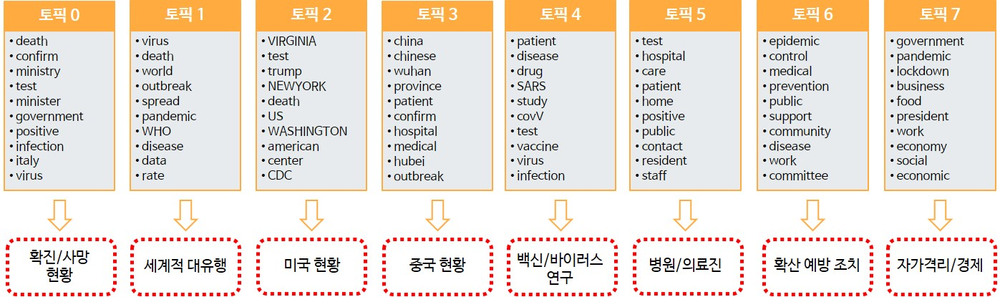
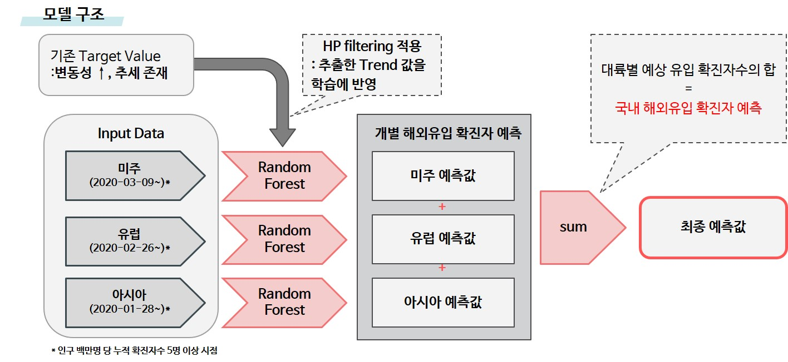

## <2020 포스트 코로나 챌린지 프로젝트>
  
  
##### 이 프로젝트는 <2020 포스트 코로나 챌린지 프로젝트> 출품작으로, 우수상을 수상한 PURIFIER팀의 코드와 발표 내용을 공유하는 목적으로 만들어졌습니다.

- 공모전 주제 : 해외의 감염병이 국내로 유입될 위험도 산출 모델링
- 공모전 목적 : 국내 해외유입 확진자수를 예측하여 감염병 대응 의사결정에 도움을 준다.
- 공모전 기간 : 2020.04.06 ~ 2020.05.10
- 주최: AI HUB, 과학기술정보통신부, 한국정보화진흥원, kt
- 수상: 우수상   
- 공모전 링크: http://www.aihub.or.kr/problem_contest/covid19

# 목차
[1. 프로젝트 배경](#1-프로젝트-배경)   
[2. 데이터 소개 및 전처리](#2-데이터-소개-및-전처리)   
[3. 뉴스 기사 데이터 토픽 모델링](#3-뉴스-기사-토픽-모델링)   
[4. 모델 개발 및 훈련](#4-모델-개발-및-훈련)   
[5. 결과](#5-결과)  

[-DATA 폴더 설명](#data-폴더)   
[-Source Code 설명](#source-code-설명)
[-Contributor](#마무리)
 
 

## 1 프로젝트 배경

- 중국에서 시작된 신종 바이러스 COVID-19 가 세계적 대유행이 되었다. 한국에서도 1월부터 전파가 시작되어 현재까지 1만명 이상의 누적 확진자수를 보이며 **확산이 지속**되고 있다.
- 해외에서 유입되는 전염력이 강한 감염병은 지역 감염으로 쉽게 번져 큰 피해로 이어진다. 이에 따라 정부는 예방을 위한 **해외유입 대응 정책**을 실시하고 있다. 
  - 중국 후베이성에서 입국하는 모든 외국인 입국 제한 조치
  - 특별 입국절차* 진행
  - 인천국제공항 유증상자 4단계 고강도 검역체계 가동
  - 모든 입국자 진단검사 실시
  - 모든 해외 입국자 14일 원칙적 격리 실시

- 이를 통해 국내로 입국하는 내/외국인의 숫자가 현저하게 줄어들어 감염병의 유입 위험을 감소시키기는 하였지만, 이러한 조치는 막대한 **경제적인 피해**를 동반하게 된다.

> **따라서, 프로젝트의 목표는 *해외유입 확진자수*를 예측하여 어느 시점에 국내 입국절차를 정상 복원할 지에 대한 의사결정을 돕는 것이다**
 
 

## 2 데이터 소개 및 전처리

   

### A.해외 COVID-19 현황 데이터

>**INSIGHT** 확산 시기가 대륙별로 다르고 전파 진행 속도에도 차이가 있다. 백만명당 누적 확진자수 기준으로 5명 이상에서 확산 속도가 빨라지는 것을 확인할 수 있다. 
>>**따라서**, 대륙별로 나누고, 각 대륙별 백만명당 누적 확진자수가 5명을 초과하는 날짜를 기점으로 학습에 사용하였다.
 
 

### B.일일 입국자수 데이터

- 전반적으로 해외 입국자수가 2-3월에 크게 감소하였다. 유럽과 미주, 호주의 경우 입국자수가 급감하였다가 3월 중순에 다소 상승하는 양상을 보이고 있다. 
 
 

### C.로밍 이용 사용자 데이터
- B.일일 입국자수 데이터와 비교하여 로밍데이터는 사용하지 않고 B 데이터만 사용하기로 하였다.
 
 

### D.뉴스기사 데이터
- 2020년 1월 9일~ 2020년 5월 5일에 게시된 뉴스 기사 데이터
- 총 112,613개의 데이터 중 -> COVID-19 관련 기사 선별 (81,766개) -> 무의미한 뉴스 기사(영어 이외 기사, 길이가 너무 짧은 기사) 제거 한 후 53,299개의 데이터 사용

**자연어 처리**
1. Cleaning
2. Tokenization
3. Normalization
4. Stopword
5. Lemmatization
 
 

## 3 뉴스 기사 토픽 모델링

 
 

## 4 모델 개발 및 훈련

> **INSIGHT**
> 1. 시간에 의존적인 변수들
>   - Topic(0-7), 기사 개수, 확진자수, 입국자수에 Lag 0~14 하여 컬럼 추가
> 2. 이전 시점 해외유입 확진자수의 평균, 편차를 계산하여 컬럼 추가
> 3. HP Filtering 적용하여 trend를 에측
> 4. 인구 백만명 당 누적 확진자수 5명 이상인 시점부터 학습.
> 5. 호주, 아프리카 발(發) 해외유입 확진자수는 대부분이 0이었기 때문에 모델 학습하지 않음
> 6. 미주, 유럽, 중국 외 아시아를 대륙별로 나누어 Random Forest 적용, 각 예측값을 합산하여 최종 예측값 도출
 
 

### 5 결과
|  
 일자
 |  
5/6
 |  
5/7
 |   
5/8
 |  
5/9
 |  
5/10
 |   
5/11
 |  
5/12
 |  
5/13
 |   
5/14
 |  
5/15
 |  
5/16
 |   
5/17
 |  
5/18
 |  
5/19
 | 
|:--------:|:--------:|:--------:|:--------:|:--------:|:--------:|:--------:|:--------:|:--------:|:--------:|:--------:|:--------:|:--------:|:--------:|:--------:|
| 
 실제값 
 | 
2
 | 
3
 |   
 11
 | 
1
 | 
8 
 | 
 6 
 | 
5 
 | 
4 
 | 
3 
 | 
5 
 | 
10 
 | 
 7 
 | 
 10 
 | 
4
 |
| 
 예측값 
 | 
6 
 | 
6 
 |   
6
 | 
5
 | 
5
 |   
4 
 | 
4 
 | 
5
 |   
 5
 | 
5 
 | 
5
 |   
4
 | 
5 
 | 
5 
 |
| 
 오차 
 | 
4
 | 
3
 |   
5
 | 
4
 | 
3
 |   
2
 | 
1
 | 
1
 |   
2
 | 
0
 | 
5
 |   
3
 | 
5
 | 
1
 |  
 
 
 
 
 

================================================================================
## DATA 폴더
- 주최측 제공 데이터( 기사, 로밍 데이터)는 저작권에 의해 업로드가 불가합니다.  
- 일일 입국자수 데이터(항공정보포탈시스템: http://www.airportal.go.kr/)  
- 해외 코로나 확진자수 현황 데이터 (질병관리본부 보도자료: http://www.cdc.go.kr/)  
- 국내 해외유입 확진자수 데이터(감염병now: http://ncov.mohw.go.kr/)

### Source Code 설명
#### 1. <전처리>  
- A.뉴스 데이터
- B.해외 신규 확진자 데이터  
- C.해외 입국자 데이터 
- D.로밍 데이터  
- E.국내 해외유입  확진자 수 데이터  
- F. (B)-> 대륙별 신규 확진자(백만명 당)  
#### 2. <NLP 모델링>  
- LDA를 통한 Topic 추출:  
0번째 Topic: 0.020*"death" + 0.012*"confirm" + 0.011*"ministry" + 0.010*"test" + 0.010*"minister" +...  
1번째 Topic: 0.019*"virus" + 0.012*"death" + 0.009*"world" + 0.008*"outbreak" + 0.008*"spread" +...  
2번째 Topic: 0.061*"VIRGINIA" + 0.031*"test" + 0.022*"trump" + 0.017*"NEWYORK" + 0.016*"death" + 0.016*"US" +...  
3번째 Topic: 0.077*"china" + 0.031*"chinese" + 0.023*"wuhan" + 0.019*"province" + 0.013*"patient" +...   
4번째 Topic: 0.020*"patient" + 0.012*"disease" + 0.010*"drug" + 0.010*"SARS" + 0.010*"study" + 0.009*"covV" +...  
5번째 Topic: 0.018*"test" + 0.014*"hospital" + 0.013*"care" + 0.013*"patient" + 0.012*"home" + 0.008*"positive" +...  
6번째 Topic: 0.014*"epidemic" + 0.011*"control" + 0.011*"medical" + 0.009*"prevention" + 0.008*"public" +...  
7번째 Topic: 0.011*"government" + 0.009*"pandemic" + 0.006*"lockdown" + 0.005*"business" + 0.005*"food" +...   
#### <Feature Engineering>  
  - 상관관계 확인  
  - lag 1~14 까지 주어서 모든 경우의 수를 피쳐화  
  - rolling을 사용하여 target값의 트렌드를 피쳐로 사용  
#### 3. <모델링>  
  - Train:  
미주: america_train.pkl  
유럽: europe_train.pkl  
중국 외 아시아: asia_train.pkl  
- Test:  
미주: america_test.pkl  
유럽: europe_test.pkl  
중국 외 아시아: asia_test.pkl  

- 활용 모델:  
XGBoosting( x )  
GradientBoosting( x )  
RandomForest( o )  

#### 4. <시각화>
[시각화 Output 보기](https://nbviewer.jupyter.org/github/Purifier-kr/2020_Post_Corona_Challenge/blob/master/4.%EC%8B%9C%EA%B0%81%ED%99%94_Post_Corona_Challenge_team_Purifier.ipynb)
- A.뉴스 데이터  
- B.국외 코로나 발생현황 데이터 시각화  
- C.해외 입국자 데이터 시각화  
- C-D. 미주 기준 해외 입국자와 로밍 데이터 비교  
- E.국내 해외유입 확진자 수 데이터 시각화

================================================================================
## 마무리
## Contributor>
|
:blush:
| 
이름
 | 
email
 |
|:--------:|:--------:|:--------:|
|| 
도현희
 | 
hheedeeo@gmail.com
 |
|| 
유진우
 | 
phoenix9373@naver.com
 |
|| 
주건재
 | 
binggraetogether@gmail.com
 |
|| 
채정회
 | 
cjhhi100@gmail.com
 |
  
#### 자세한 ppt는 SlideShare에서 확인하실 수 있습니다: (https://www.slideshare.net/HyeonHeeDo/ai-post-corona-ai-challenge)
